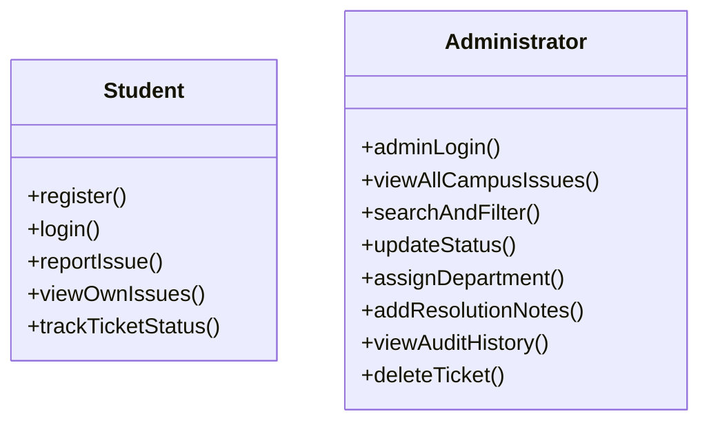
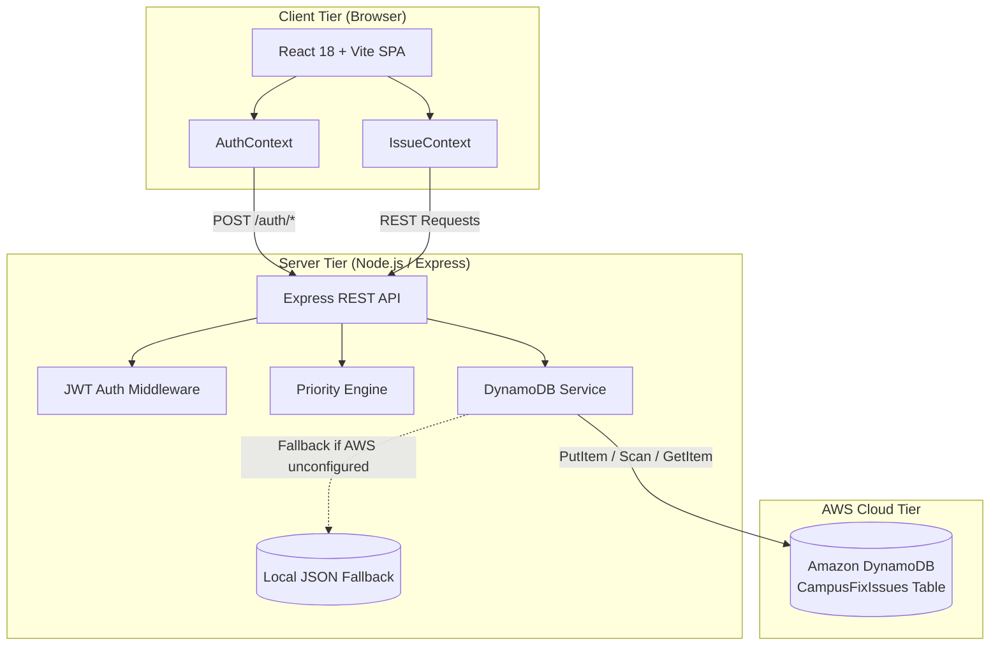
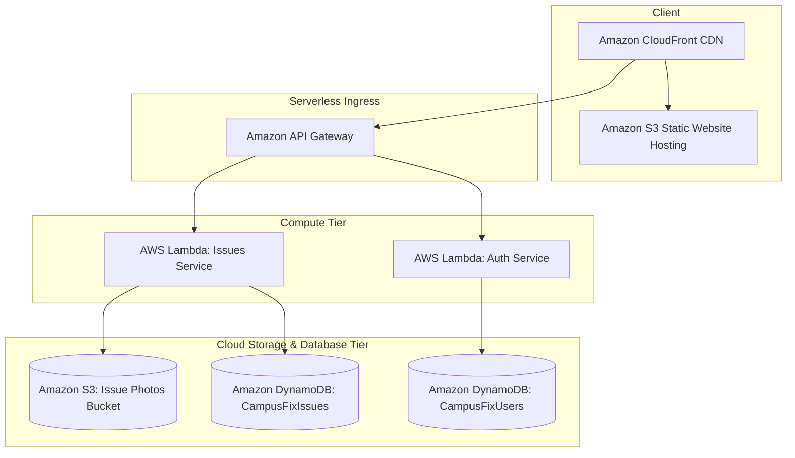

# CampusFix — Smart Campus Issue Reporting & Resolution System

> A centralized platform for students to report, track, and automatically prioritize campus facility issues, while providing university administration with an actionable real-time management dashboard.

[](https://aws.amazon.com)
[](https://aws.amazon.com/dynamodb/)
[](https://react.dev/)
[](https://expressjs.com/)
[](#license)

---

## Table of Contents

1. [Problem Statement](#1-problem-statement)
2. [Solution](#2-solution)
3. [Key Features](#3-key-features)
4. [Automatic Priority Engine](#4-automatic-priority-engine)
5. [User Roles](#5-user-roles)
6. [Campus Coverage](#6-campus-coverage)
7. [Issue Data Model](#7-issue-data-model)
8. [Technology Stack](#8-technology-stack)
9. [Architecture](#9-architecture)
   - [Current Architecture (Implemented)](#current-architecture-implemented)
   - [Future AWS Architecture (Planned)](#future-aws-architecture-planned)
10. [AWS Integration](#10-aws-integration)
11. [Backend API](#11-backend-api)
12. [Project Structure](#12-project-structure)
13. [Installation & Setup](#13-installation--setup)
14. [Environment Variables](#14-environment-variables)
15. [Demo Workflow](#15-demo-workflow)
16. [Security & Authorization](#16-security--authorization)
17. [Future Scope](#17-future-scope)
18. [Hackathon Context](#18-hackathon-context)
19. [Team](#19-team)
20. [License](#20-license)

---

## 1. Problem Statement

Across university campuses, physical facility maintenance and safety issues (e.g., exposed live electrical wires, broken plumbing, malfunctioning classroom projectors, network failures, damaged lecture furniture) are commonly reported through informal and fragmented channels:

- **Verbal Complaints**: Facility staff or department clerks are told verbally, leading to forgotten requests and missed details.
- **WhatsApp Groups & Chat Messages**: Reports get buried in high-volume chat threads without tracking tickets or reference IDs.
- **Lack of Centralized Tracking**: Neither students nor university administrators have a unified single source of truth for the status of pending repairs.
- **Subjective / Non-Prioritized Handling**: Without systematic evaluation, urgent life-safety hazards (like exposed high-voltage wiring) can sit in the same queue behind cosmetic repairs (like a scratched desk).
- **Lack of Transparency & Accountability**: Students have no visibility into whether their tickets are acknowledged, assigned, or resolved, resulting in duplicate reports and student frustration.

---

## 2. Solution

**CampusFix** eliminates informal communication bottlenecks by establishing a transparent, deterministic, and closed-loop reporting workflow:

```mermaid
flowchart LR
    A[Student] -->|1. Reports Issue| B[CampusFix Portal]
    B -->|2. Deterministic Analysis| C[Automatic Priority Engine]
    C -->|3. Persists Ticket| D[(Amazon DynamoDB)]
    D -->|4. Real-time Dashboard| E[University Administration]
    E -->|5. Assigns & Updates Status| F[Status Lifecycle]
    F -->|6. Status Audit & Notes| G[Live Student Tracking]
```



### Complete End-to-End Workflow:
1. **Student** registers/logs in using institutional credentials.
2. **Issue Reported**: Student specifies campus building, floor, room location, category, title, description, and optional photo.
3. **Automatic Priority**: The system calculates priority (`Critical`, `High`, `Medium`, `Low`) and generates a detailed reason string using deterministic keyword and category analysis.
4. **Administration Dispatch**: Estate & Facilities Administration inspects incoming tickets, filters by building, category, or priority, and assigns the responsible department.
5. **Status Lifecycle**: Admins transition status through `Pending` &rarr; `In Progress` &rarr; `Resolved`, appending official resolution notes.
6. **Student Tracking**: The student monitors resolution progress and inspects the timestamped audit log in real time.

---

## 3. Key Features

### Authentication & Authorization
- **Student Registration**: Validates institutional email (`@csmu.ac.in`), enrollment number, password length, and confirms unique accounts.
- **Student Login**: Dual-identifier authentication accepting either college email or enrollment number.
- **Dedicated Administrator Login**: Independent administrative access portal for facility officers and HODs.
- **JWT Authentication**: Stateless, signed JSON Web Tokens (7-day validity) securing all protected API calls.
- **Password Hashing**: Strong bcrypt salt-and-hash encryption (`bcryptjs`, 10 rounds).
- **Role-Based Access Control (RBAC)**: Enforced authorization boundaries separating student actions from administrative actions.

### Issue Reporting & Prioritization
- **Campus-Specific Location Picker**: Dynamic selector covering CSMU academic blocks, floors, and common campus facilities.
- **Common Presets**: One-click quick-fill templates for frequent campus issues (e.g., projector failure, water leakage, broken fan).
- **Automatic Priority Engine**: Computes urgency deterministically without student bias.
- **Priority Reason Transparency**: Generates human-readable explanations detailing why a specific priority was assigned.
- **Future-Ready Image Handling**: Supports image URLs while omitting raw Base64 payloads from database items to stay lightweight and S3-ready.

### Administration & Operations
- **Real-Time Admin Dashboard**: Summary statistics displaying total issues, pending counts, active repairs, resolved tickets, and active critical alerts.
- **Multi-Filter & Search**: Filter tickets by Status, Priority, Category, Building, or instant text search across ticket IDs, locations, and reporter names.
- **Issue Lifecycle Management**: Full control to update status between `Pending`, `In Progress`, and `Resolved`.
- **Resolution Documentation**: Admins record resolution remarks and department assignments.
- **Immutable Audit Trail (`activityLog`)**: Comprehensive timeline logging ticket creation, state changes, admin notes, and timestamps.
- **DynamoDB Persistence with Local Fallback**: Primary cloud database storage on AWS DynamoDB with graceful local fallback if AWS credentials are not configured locally.

---

## 4. Automatic Priority Engine

Rather than allowing students to manually select urgency—which often leads to queue inflation where every ticket is marked "urgent"—CampusFix implements an **authoritative automatic priority engine** ([server/utils/priorityEngine.js](server/utils/priorityEngine.js) and [src/utils/priorityEngine.js](src/utils/priorityEngine.js)).

The algorithm analyzes the issue category, title, and description against standardized criteria:

| Priority | Criteria & Keyword Triggers | SLA / Target Action | Example Scenario |
| :--- | :--- | :--- | :--- |
| **`Critical`** | Immediate danger to life, health, or campus safety. Keyword triggers: `fire`, `spark`, `shock`, `electric shock`, `short circuit`, `exposed wire`, `live wire`, `smoke`, `gas leak`, `structural collapse`, `ceiling collapse`, `emergency`, `injury`, `stampede`, `burn`.<br>*(All issues filed under category **`Safety`** automatically escalate to Critical).* | Immediate dispatch (< 1 hour) | Exposed live wiring sparking on a 1st-floor corridor switchboard. |
| **`High`** | Major facility breakdown causing structural, electrical, or water damage. Keyword triggers: `major water leakage`, `flooding`, `overflowing sewage`, `no water`, `blackout`, `power outage`, `elevator stuck`, `lift stuck`, `burst pipe`, `deep crack`, `chemical spill`.<br>*(Triggered by **`Plumbing`** with leaks/water, or **`Electrical`** with power/breakers).* | Urgent turnaround (4–12 hours) | Overhead pipeline burst flooding a passage near the washrooms. |
| **`Medium`** | Academic or utility disruptions affecting routine campus operations. Keyword triggers: `wifi`, `internet`, `projector`, `hdmi`, `ac`, `air conditioner`, `fan speed`, `audio`, `mic`, `computer`, `monitor`, `power socket`, `water cooler`, `canteen food`, `printer`.<br>*(Default for categories: `IT / Wi-Fi`, `Classroom / Lab`, `Hostel`, `Canteen`).* | Scheduled routine maintenance (24–48 hours) | Ceiling projector showing "No Signal" in lecture hall 204. |
| **`Low`** | Cosmetic defects, minor maintenance, or standard housekeeping. Keyword triggers: `broken chair`, `bench`, `desk`, `scratch`, `dust`, `bin full`, `garbage`, `trash`, `curtain`, `paint`, `whiteboard marker`, `door hinge`, `cosmetic`.<br>*(Default for categories: `Cleanliness`, `Sports`, `Infrastructure`, `Other`).* | Batched housekeeping rounds | Double-bench armrest splintered or whiteboard marker dried out. |

---

## 5. User Roles



### Student
- Create account with college email and enrollment number.
- Submit new tickets with campus location and description.
- Preview automatic priority calculation in real time while typing.
- Access dedicated dashboard viewing own submitted issues only.
- Track resolution status (`Pending`, `In Progress`, `Resolved`) and read admin resolution notes.

### Administrator
- Dedicated administrator sign-in portal.
- University-wide visibility across all submitted campus issues.
- Interactive dashboard with breakdown by priority, category, and building.
- Filter, sort, and search across all open and resolved tickets.
- Transition ticket status and append official resolution notes.
- Route issues to specific departments (e.g., *IT & Network Services*, *Electrical Maintenance Unit*, *Plumbing & Water Management*, *Campus Housekeeping*).

---

## 6. Campus Coverage

The platform is tailored to **Chhatrapati Shivaji Maharaj University (CSMU), Panvel**, supporting:

### Academic Wings & Buildings
- **Rajgad**: Main Academic Wing — Engineering & Science
- **Pratapgad**: Academic Block — Commerce & Management
- **Sindhudurg**: Academic Block — Computer Applications & IT
- **Shivneri**: Academic Wing — Humanities & Architecture
- **Pharmacy Block**: Pharmacy Block & Faculty of Law (Law College)

### Floors
- Ground Floor, 1st Floor, 2nd Floor, 3rd Floor, 4th Floor

### Campus Facilities & Amenities
- Library, Main Gate, Parking, Reception, Admin Office, Examination Cell, Medical / First Aid Room, Labs, Computer Labs, Faculty Rooms, Washrooms, Drinking Water Areas, Elevators / Lifts, Staircases, Common Canteen, Auditorium, Hostel, Volleyball Court, Badminton Court, Football Ground, Sports Room.

### Issue Categories
- `Infrastructure`, `Electrical`, `Plumbing`, `Cleanliness`, `IT / Wi-Fi`, `Classroom / Lab`, `Hostel`, `Canteen`, `Sports`, `Safety`, `Other`.

---

## 7. Issue Data Model

The issue data structure is strictly defined and preserved across the backend and frontend:

```typescript
interface Issue {
  id: string;                     // Sequential Ticket ID e.g. "CF-2026-001"
  issueId: string;                // DynamoDB Partition Key (identical to id)
  title: string;                  // Short description of the issue
  description: string;            // Full explanation of the problem
  category: string;               // Infrastructure | Electrical | Plumbing | Safety | etc.
  priority: 'Critical' | 'High' | 'Medium' | 'Low';
  priorityReason: string;         // Automated justification generated by Priority Engine
  building: string;               // Campus building or wing name
  floor: string;                  // Floor level e.g. "1st Floor"
  location: string;               // Specific room or landmark detail
  reporterId: string;             // User ID of student reporter
  reporterName: string;           // Full name of student
  reporterEmail: string;          // College email (@csmu.ac.in)
  image: string | null;           // Image URL (S3 / remote) or null; Base64 is not stored
  status: 'Pending' | 'In Progress' | 'Resolved';
  assignedDepartment: string;     // University department handling resolution
  resolutionNotes: string;        // Remarks recorded by admin upon resolution
  createdAt: string;              // ISO 8601 creation timestamp
  updatedAt: string;              // ISO 8601 last modified timestamp
  activityLog: Array<{            // Audit log tracking lifecycle events
    date: string;
    text: string;
  }>;
}
```

---

## 8. Technology Stack

### Frontend
- **React 18** (`react`, `react-dom`): Component-based user interface.
- **Vite 5**: Next-generation development tooling and production bundler.
- **React Router 7** (`react-router-dom`): Client-side routing with protected route wrappers.
- **Lucide React** (`lucide-react`): UI iconography.
- **Vanilla CSS**: Custom responsive styling with accessible contrast ratios.

### Backend & Cloud
- **Node.js 18+**: ES Modules server runtime.
- **Express 4** (`express`): RESTful API framework.
- **Amazon DynamoDB**: NoSQL cloud database for issue persistence.
- **AWS SDK for JavaScript v3** (`@aws-sdk/client-dynamodb`, `@aws-sdk/lib-dynamodb`): Official AWS SDK client and DocumentClient.
- **JSON Web Tokens** (`jsonwebtoken`): Stateless session signing and verification.
- **bcryptjs** (`bcryptjs`): Password hashing algorithm.
- **cors**: Cross-Origin Resource Sharing handling.
- **dotenv**: Environment variable management.

---

## 9. Architecture

### Current Architecture (Implemented)

The application currently operates as an end-to-end full-stack web application with direct Amazon DynamoDB persistence:



### Future AWS Architecture (Planned)

In a fully serverless production deployment on AWS, the architecture can evolve to:



> **Note on Implementation Status**: The current implementation runs an Express server connecting directly to **Amazon DynamoDB** using the AWS SDK v3. API Gateway, AWS Lambda, and Amazon S3 are planned evolutions.

---

## 10. AWS Integration

### Amazon DynamoDB Implementation
- **Table Name**: `CampusFixIssues` (configurable via `DYNAMODB_TABLE` or `DYNAMODB_ISSUES_TABLE`).
- **Partition Key**: `issueId` (String).
- **Client Configuration**: AWS SDK v3 `DynamoDBDocumentClient` with automatic unmarshaling and empty-value handling.
- **Operations Implemented**:
  - `ScanCommand`: Paged table scan for administrative queries and dashboard metrics.
  - `GetCommand`: Fast key-based lookup by partition key `issueId`.
  - `PutCommand`: Atomic creation and full-state updates preserving the activity log.
  - `DeleteCommand`: Removal of issues by partition key.

### S3-Ready Image Sanitization
DynamoDB has a hard limit of 400 KB per item. Raw Base64 photo uploads can easily exceed 1–5 MB.
- When an issue is logged, `sanitizeImageForStorage()` checks if the image is an HTTP/HTTPS or S3 URL.
- If it is a Base64 string (`data:image/...`), it is **omitted from the DynamoDB item** (`null`).
- This keeps DynamoDB items compact and ensures full compatibility with a future S3 bucket upload integration.

### Migration Tool
A migration script is included to copy existing JSON seed issues into the `CampusFixIssues` DynamoDB table:
```bash
npm run migrate:dynamo --prefix server
```
On boot, `initDb()` also checks if the target DynamoDB table is empty and automatically migrates initial seed data.

### Local Development Resilience
If AWS credentials are not yet configured on a developer's local machine, the application logs a status notice and falls back to local storage without crashing, allowing frontend styling and testing to proceed offline.

---

## 11. Backend API

All endpoints are hosted under the `/api` prefix:

| Method | Endpoint | Description | Access / Authorization |
| :--- | :--- | :--- | :--- |
| `GET` | `/api/health` | Service health check, uptime, and university banner | Public |
| `POST` | `/api/auth/register` | Register a new student account (bcrypt hashed) | Public |
| `POST` | `/api/auth/login` | Student login with email or enrollment number | Public |
| `POST` | `/api/auth/admin-login` | Dedicated administrator login | Public |
| `GET` | `/api/auth/me` | Fetch profile of currently authenticated user | Bearer JWT (Any authenticated user) |
| `GET` | `/api/issues` | List issues (students see own; admins see all; supports `?status=`, `?priority=`, `?category=`, `?building=`, `?search=`) | Bearer JWT (Any authenticated user) |
| `GET` | `/api/issues/:id` | Fetch details of a single ticket | Bearer JWT (Admin or ticket owner) |
| `POST` | `/api/issues` | Report a new issue (triggers Priority Engine, saves to DynamoDB) | Bearer JWT (Student / Admin) |
| `PUT` | `/api/issues/:id` | Update status (`Pending`, `In Progress`, `Resolved`), resolution notes, and department | Bearer JWT (**Admin role required**) |
| `DELETE` | `/api/issues/:id` | Permanently remove a ticket | Bearer JWT (**Admin role required**) |

---

## 12. Project Structure

```
AWS CampusFix/
├── index.html                   # Single-page application HTML entrypoint
├── package.json                 # Frontend dependencies (React, Vite, React Router)
├── vite.config.js               # Vite config with /api development proxy
├── vercel.json                  # Multi-service deployment configuration
├── README.md                    # Project documentation
├── public/                      # Static assets
├── src/                         # Frontend Application Source
│   ├── main.jsx                 # React root mount
│   ├── App.jsx                  # Main routing tree and global university footer
│   ├── index.css                # Global design system, typography, animations
│   ├── components/
│   │   ├── common/              # Navbar, StatCard, PriorityBadge, StatusBadge, Toast, Modal
│   │   └── issues/              # IssueForm, IssueCard, IssueTable, FilterBar
│   ├── context/
│   │   ├── AuthContext.jsx      # JWT session management and user state
│   │   └── IssueContext.jsx     # Issues fetching, reporting, mutation, and live stats
│   ├── data/
│   │   └── campusData.js        # CSMU buildings, floors, categories, and quick presets
│   ├── pages/
│   │   ├── auth/                # LoginPage, RegisterPage, AdminLoginPage
│   │   ├── student/             # StudentDashboard, StudentReportIssue, StudentIssues
│   │   └── admin/               # AdminDashboard, AdminIssues, AdminIssueDetail
│   └── utils/
│       ├── formatters.js        # Date, time, and text formatters
│       └── priorityEngine.js    # Client-side real-time priority preview calculator
└── server/                      # Backend API Server
    ├── package.json             # Backend dependencies (Express, AWS SDK, JWT, bcrypt)
    ├── server.js                # Express app initialization, CORS, API routes
    ├── .env.example             # Template for required environment variables
    ├── data/                    # Seed data (users.json, issues.json)
    ├── middleware/
    │   └── auth.js              # JWT verification and RBAC middleware
    ├── routes/
    │   ├── auth.js              # Registration, login, and profile endpoints
    │   └── issues.js            # Issue CRUD endpoints with role filters
    ├── scripts/
    │   └── migrateIssuesToDynamo.js # Migration tool from JSON to DynamoDB
    ├── services/
    │   └── dynamoDb.js          # AWS SDK DynamoDB DocumentClient service
    └── utils/
        ├── db.js                # Database abstraction with DynamoDB integration
        └── priorityEngine.js    # Authoritative backend deterministic priority engine
```

---

## 13. Installation & Setup

### Prerequisites
- **Node.js** (v18.x or later)
- **npm** (v9.x or later)
- *(Optional)* AWS Account with DynamoDB table access for live cloud persistence.

### 1. Clone the Repository
```bash
git clone https://github.com/swaroopkhot07/CampusFix.git
cd "CampusFix"
```

### 2. Install Dependencies
Install both root (frontend) and server dependencies:
```bash
# Install frontend dependencies
npm install

# Install backend dependencies
cd server
npm install
cd ..
```

### 3. Configure Environment Variables
Create a `.env` file in the `server/` directory:
```bash
cp server/.env.example server/.env
```
Open `server/.env` and configure your settings (see [Environment Variables](#14-environment-variables)).

### 4. Optional: Run DynamoDB Migration
If connecting to an existing DynamoDB table:
```bash
npm run migrate:dynamo --prefix server
```

### 5. Start the Application
Run both servers concurrently in separate terminal tabs:

**Terminal 1 — Backend Server:**
```bash
npm run server
# Server runs on http://localhost:5000
```

**Terminal 2 — Frontend App:**
```bash
npm run dev
# Frontend runs on http://localhost:5173
```

Open [http://localhost:5173](http://localhost:5173) in your browser.

---

## 14. Environment Variables

Configure the following variables in `server/.env`. **Never commit your actual `.env` file to Git.**

| Variable Name | Purpose | Example / Default |
| :--- | :--- | :--- |
| `PORT` | Backend listening port | `5000` |
| `JWT_SECRET` | Secret key used to sign and verify JWT session tokens | *Generate a secure random string* |
| `CLIENT_URL` | Frontend origin URL for CORS policy | `http://localhost:5173` |
| `AWS_REGION` | AWS Region for DynamoDB client | `ap-south-1` |
| `DYNAMODB_TABLE` | Name of the Amazon DynamoDB table for tickets | `CampusFixIssues` |
| `AWS_ACCESS_KEY_ID` | AWS IAM Access Key *(optional if using IAM Role)* | `your_access_key_here` |
| `AWS_SECRET_ACCESS_KEY` | AWS IAM Secret Key *(optional if using IAM Role)* | `your_secret_key_here` |
| `DYNAMODB_ENDPOINT` | *(Optional)* Custom endpoint for DynamoDB Local | `http://localhost:8000` |
| `AWS_S3_BUCKET` | *(Planned)* Future S3 Bucket name for photo uploads | `campusfix-issues-photos` |

---

## 15. Demo Workflow

Follow these steps to demonstrate the end-to-end user journey during a hackathon walkthrough:

```
[1. Student Login] ──> [2. Report Issue] ──> [3. Auto Priority] ──> [4. Admin Login] ──> [5. Update & Resolve] ──> [6. Student Tracks]
```

1. **Student Registration / Sign In**:
   - Navigate to `/` (Student Login) or `/register`.
   - Sign in using an existing student account (e.g., `swaroopkhot@csmu.ac.in`) or create a new student profile.
2. **Report an Urgent Facility Issue**:
   - Go to **Report Issue** (`/student/report`).
   - Select Building **"Shivneri"**, Floor **"1st Floor"**, Category **"Safety"**.
   - Type Title: *"Exposed wiring sparking in corridor"*.
   - Notice the **Automatic Priority Engine** instantly computes **Critical** with an automated safety explanation.
   - Click **Submit Ticket**. A confirmation toast displays the ticket ID (e.g., `CF-2026-011`).
3. **Student View**:
   - Navigate to **My Issues** (`/student/issues`) to see the newly submitted ticket in `Pending` state.
4. **Administrator Login**:
   - Log out, navigate to `/admin-login`.
   - Sign in with administrative credentials.
5. **Admin Ticket Management**:
   - The **Admin Dashboard** displays live counters: total tickets, pending, and critical alerts.
   - Click on the new ticket to open **Admin Issue Detail** (`/admin/issues/:id`).
   - Update Status to **"In Progress"**, assign to **"Electrical Maintenance Unit"**.
   - Later, change status to **"Resolved"** and append Resolution Notes: *"Circuit breaker isolated and modular polycarbonate faceplate replaced by duty electrician."*
6. **Student Verification**:
   - Log back into the student account.
   - The ticket displays the green **Resolved** badge, updated department assignment, resolution notes, and complete timestamped audit log.

---

## 16. Security & Authorization

- **Password Encryption**: All student and administrator passwords are encrypted using `bcryptjs` with salt rounds prior to persistence.
- **Cryptographic JWT Tokens**: Sessions are authenticated using signed HS256 JWT tokens containing user ID, institutional email, and user role. Tokens expire after 7 days.
- **Role-Based Middleware**: `requireAdmin` and `requireStudent` middleware intercept incoming requests at the API layer, blocking unauthorized horizontal or vertical privilege escalation.
- **Tenant Isolation**: Students are strictly prohibited from viewing tickets submitted by other students (`403 Forbidden` if attempting to fetch an ID not belonging to them).
- **No Secret Leakage**: Passwords (`passwordHash`) are excluded from all database queries returned across API boundaries. Sensitive configuration is kept in environment files excluded by `.gitignore`.

---

## 17. Future Scope

- **Serverless AWS Migration**: Migrate Express endpoints to individual **AWS Lambda** functions routed through **Amazon API Gateway** for auto-scaling.
- **Amazon S3 Photo Storage**: Implement presigned S3 URLs allowing direct client-to-bucket photo uploads, storing clean S3 asset URLs in DynamoDB.
- **Amazon SNS / SES Notifications**: Real-time SMS and email alerts notifying students when their ticket status changes to `In Progress` or `Resolved`.
- **Amazon Rekognition / Bedrock AI**: Automatic computer vision verification to detect damage severity from uploaded photos, coupled with LLM-based facility assignment.
- **Interactive Campus GIS Map**: 2D/3D map of CSMU Panvel allowing students to drop a pin on exact maintenance spots.
- **Cross-Platform Mobile Application**: React Native mobile app with offline report queueing and push notifications.

---

## 18. Hackathon Context

This project was developed for the **AWS Student Builder Hackathon / BUILDERS BREAKOUT**.

- **Focus**: Building resilient, cloud-integrated infrastructure for educational institutions.
- **Active AWS Service**: **Amazon DynamoDB** (high-throughput, low-latency NoSQL database for ticket persistence using partition keys).
- **Target Institution**: Chhatrapati Shivaji Maharaj University (CSMU), Panvel, Maharashtra.

---

## 19. Team

- **Swaroop Khot** ([@swaroopkhot07](https://github.com/swaroopkhot07)) — *Lead Developer / AWS Builder*

---

## 20. License

Developed for academic and hackathon demonstration purposes during the AWS Student Builder Hackathon. All rights reserved.
